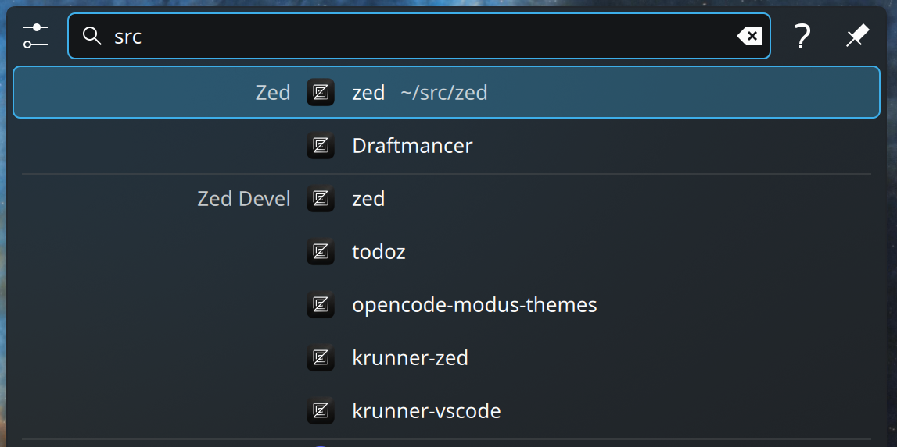

[](https://github.com/hron/krunner-zed/actions)
[](https://aur.archlinux.org/packages/krunner-zed)
[](https://store.kde.org/p/2354408)

A KRunner plugin / "runner" that lists Zed's recent workspaces

- Quickly re-open the workspace in Zed by pressing `Enter`
- Supports: Stable, Dev versions of Zed


## Screenshot



## Requirements

- kstart (optional)
  - Recommended: `kstart` (kde-cli-tools) makes Zed appear under the configured application id,
    which helps distinguish Zed processes in tools like KDE System Monitor. If `kstart` is not
    available, the runner will still launch Zed directly, but the process may not be associated
    with the desktop application id in process lists.
  - Arch: `sudo pacman -S kde-cli-tools`

## Building

```bash
cargo build --release
```

## Install plugin

```bash
cp target/release/krunner-zed package/krunner-zed && package/install.sh
```

## Uninstall plugin

```bash
package/uninstall.sh
```
